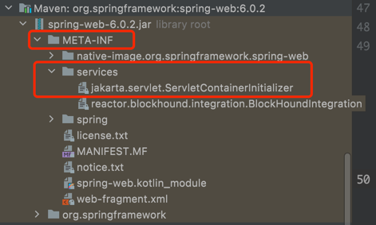
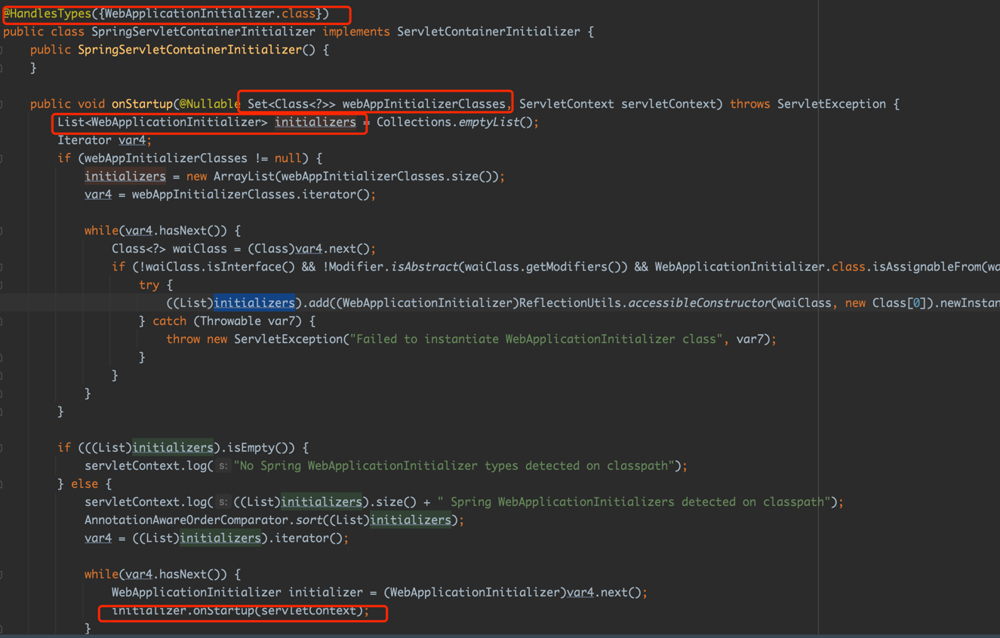
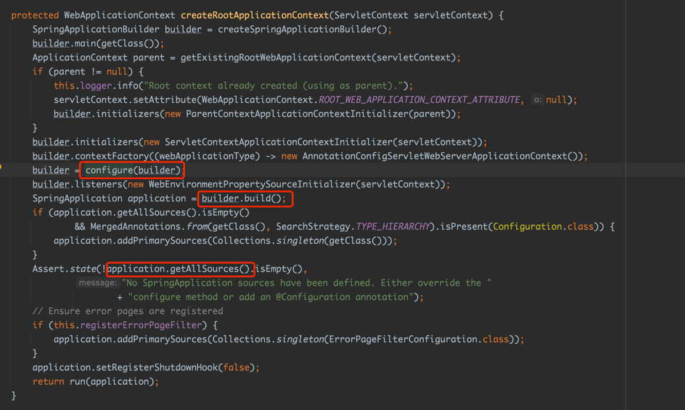

# 背景

对于Spring Boot应用，我们一般会打成jar包使用内置容器运行，但是有时候我们想要像使用传统springweb项目一样，将Spring Boot应用打成WAR包，然后部署到外部容器运行，那么我们传统的使用Main类启动的方式稍显蹩脚，因为外部容器无法识别到应用启动类，那我们应该怎么配置才能够让我们的应用部署到外置的web容器中运行呢

# 方法
这里有两种方法，如spring-boot-package和spring-boot-package-war所示。

- **方法一**（见spring-boot-package）

应用启动类继承SpringBootServletInitializer类，同时重写config方法。如下代码，这里的应用启动类是PackageApplication。
````java
@SpringBootApplication
public class PackageApplication extends SpringBootServletInitializer {

	@Override
	protected SpringApplicationBuilder configure(SpringApplicationBuilder application) {
		return application.sources(PackageApplication.class);
	}

	public static void main(String[] args) {
		SpringApplication.run(PackageApplication.class, args);
	}
}
````
- **方法二**（见spring-boot-package-war）

保持应用启动类不变，新建一个类继承SpringBootServletInitializer类，同时重写config方法，内部指定应用启动类。如下代码，这里的应用启动类是Application。
```java
public class ServletInitializer extends SpringBootServletInitializer {
    @Override
    protected SpringApplicationBuilder configure(SpringApplicationBuilder application) {
        return application.sources(Application.class);
    }
}
```
至于到底是打包成war包还是jar包格式，在pom.xml文件中指定
```xml
<project>
    <groupId>com.neo</groupId>
    <artifactId>spring-boot-package</artifactId>
    <version>1.0.0</version>
    <packaging>war或者jar</packaging>
</project>
```

# 原理

通常情况下，web容器启动web应用需要读取war包中的web.xml文件，进而创建servletcontext，listener，filter和servlet。但是springboot已经将web.xml彻底去掉了，那怎样让web容器的启动入口怎么获得呢？


这边官方给出了另一个解决方案（不采用web.xml）。它提供了一个叫做ServletContainerInitializer的类，它可以通过SPI机制，当启动web容器的时候，会自动到添加的相应jar包下找到META-INF/services下以ServletContainerInitializer的全路径名称（jakarta.servlet.ServletContainerInitializer）命名的文件，它的内容为ServletContainerInitializer实现类的全路径，将它们实例化。我们在org.springframework:spring-web的jar包中找到了该文件，如下图：


打开文件可以看到Spring对ServletContainerInitializer的实现类为SpringServletContainerInitializer，这就意味着web容器启动时，会示例化SpringServletContainerInitializer，同时调用其 **onStartup()** 函数。如下图：


从代码中可以看到，onStartup()函数会利用反射实例化一组class类，同时将其添加到类型为WebApplicationInitializer（接口类）的list中，最后循环调用list中实例对象的onStart()函数。那如何保证web容器传入的class类型就是WebApplicationInitializer类型呢？这里利用了注解 **@HandlesTypes** 。

@HandlesTypes可以让web容器将找到并传递一组扩展或者实现了@HandlesTypes注释所列出的类类型，作为onStartup()方法的第一个参数，这也就是说最后传入onStart()函数是WebApplicationInitializer的所有实现类。在这里，就是SpringBootServletInitializer这个类，我们在 **方法** 中继承的父类。

这样一来，web容器启动时会调用到SpringBootServletInitializer的onStartup()函数，进而调用createRootApplicationContext()函数。在函数执行过成中，SpringApplicationBuilder会被创建，同时会调用我们重写的 **configure()** 的方法。将我们的应用启动类添加到builder的sources中。builder.build()调用将生成SpringApplication对象application，其中会将sources中的资源传给application，最后run(application)时真正启动Springboot应用。接下来的过程就同以jar包形式启动的应用的run过程一样了，在内部会创建IOC容器并返回，只是以war包形式的应用在创建IOC容器过程中，不再创建Servlet容器了。
